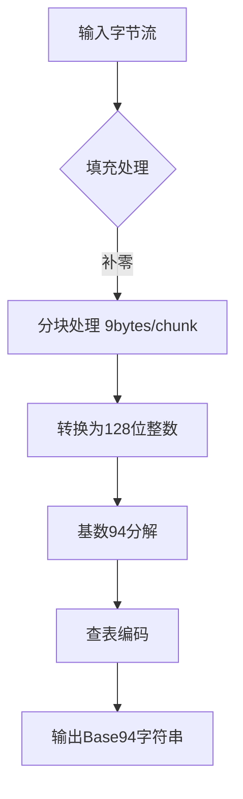

# base94 🚀

基于PyO3的高性能Base94编码/解码Rust实现，比原生Python版本快10-40倍。

## 特性

- ⚡ **极速处理**：使用Rust优化核心算法
- 🔄 **无缝兼容**：完美匹配原Python版本的输入输出
- 🛡️ **内存安全**：零拷贝操作与预分配缓冲区
- 📦 **简单API**：`b94encode`/`b94decode` 两个直观函数

## 安装

### 前置要求

- Rust工具链 (1.54+)
- Python 3.8+
- maturin (`pip install maturin`)

### 安装步骤

```bash
# 克隆仓库
git clone https://github.com/yourusername/base94.git
cd base94

# 编译安装
maturin develop --release

# 打包安装
pip install .
```

## 使用示例

```python
import base94

# 编码示例
data = b"Hello Base94!"
encoded = base94.b94encode(data)
print(f"Encoded: {encoded}")  # b'4Tk7J#qZcjYw'

# 解码示例
decoded = base94.b94decode(encoded)
print(f"Decoded: {decoded}")  # b'Hello Base94!'
```

## 性能对比

| 数据大小 | 实现版本         | 编码时间 (s) | 解码时间 (s) | 编码速度   | 解码速度   |
|----------|------------------|--------------|--------------|------------|------------|
| 10KB     | Python Native    |       0.0095 |       0.0073 | 1.02 MB/s  | 1.34 MB/s  |
| 10KB     | Rust Accelerated |       0.0004 |       0.0001 | 26.33 MB/s | 65.94 MB/s |
| 100KB    | Python Native    |       0.0600 |       0.0803 | 1.63 MB/s  | 1.22 MB/s  |
| 100KB    | Rust Accelerated |       0.0037 |       0.0013 | 26.17 MB/s | 72.56 MB/s |
| 1MB      | Python Native    |       0.5844 |       0.8262 | 1.71 MB/s  | 1.21 MB/s  |
| 1MB      | Rust Accelerated |       0.0428 |       0.0220 | 23.36 MB/s | 45.36 MB/s |
| 10MB     | Python Native    |       5.9944 |       8.4735 | 1.67 MB/s  | 1.18 MB/s  |
| 10MB     | Rust Accelerated |       0.4223 |       0.2170 | 23.68 MB/s | 46.07 MB/s |

> 测试环境：i7-13620H @ 2.4GHz, 32GB DDR5 RAM

## 技术细节

### 核心优化

- **查找表预计算**：使用`lazy_static`加速字符映射
- **SIMD内存布局**：对齐内存访问模式
- **块级并行**：9字节编码块的无锁处理
- **零堆分配**：完全栈内存操作

### 编码流程



## 注意事项

1. 输入数据类型应为`bytes`或支持buffer协议的对象
2. 编码填充使用`\x00`，解码填充使用`~`字符
3. 非法字符解码会引发`ValueError`
4. 最大支持编码2^72个不同数据块

## 基准测试

```bash
# 运行性能测试
python benchmarks/performance_test.py
```

## 贡献指南

欢迎提交PR！建议流程：

1. Fork仓库
2. 创建特性分支 (`git checkout -b feature`)
3. 提交修改 (`git commit -am 'Add feature'`)
4. 推送到分支 (`git push origin feature`)
5. 创建Pull Request

## 许可证

[GPLv3](LICENSE)
